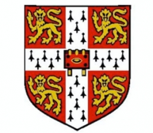

<left> <h1>About Me</h1> </left>
I am an AI Scientist (Senior Associate Consultant level) at the Mayo Clinic in Rochester Minnesota, leading AI for cancer treatment efforts at the department of radiation oncology.

Previously, I was a full-time Senior Researcher at [Microsoft Research Cambridge](https://www.microsoft.com/en-us/research/lab/microsoft-research-cambridge/), working on deep learning for molecular modelling as part of the [AI4Science initiative](https://www.microsoft.com/en-us/research/lab/microsoft-research-ai4science/). Our goal is to drive major advances in science through the use of machine learning. My current research focuses on using deep learning to model the dynamics of proteins.

I completed my PhD in the [Machine Learning Group](http://mlg.eng.cam.ac.uk/?portfolio=andrew-foong-yue-kwang) at the University of Cambridge, supervised by [Professor Richard E. Turner](http://cbl.eng.cam.ac.uk/Public/Turner/). My research focused on probabilistic modelling and deep learning, with work on Bayesian neural networks, meta-learning, equivariant models, and PAC-Bayes.

You can find a list of selected publications [here](./publications.md). For a full overview, see my [Google Scholar page](https://scholar.google.com/citations?user=2UOjgIUAAAAJ&hl=en).

Contact: andrewfoong [at] microsoft [dot] com

<left> <h1>Experience</h1> </left>

<ul style="list-style-type:none;">
<li>
	

		
		

			

			<i>January 2025 - Present, Rochester, Minnesota</i>  
			AI Scientist, Mayo Clinic 
		    Department of Radiation Oncology  
			Topics: Deep learning for cancer treatment 
			

		

	

</li>
<li>
	

		
		

			

			<i>November 2022 - November 2024, Cambridge, UK</i>  
			Senior Researcher, Microsoft Research AI4Science  
			Topics: Deep learning for molecular modelling
			

		

	

</li>
<li>
	

		
		

			

			<i>October 2018 - November 2022, Cambridge, UK</i>  
			PhD in Advanced Machine Learning, Machine Learning Group, University of Cambridge  
			Supervisor: Professor Richard E. Turner  
			Topics: Probabilistic modelling, deep learning, Bayesian deep learning, meta-learning, equivariance, PAC-Bayes
			

		

	

</li>
<li>
	

		
		

			

			<i>February 2022 - May 2022, London, UK</i>  
			Research Scientist Intern, DeepMind  
			Supervisor: Dr. Michalis Titsias  
			Topics: Deep generative modelling, Gaussian processes
			

		

	

</li>
<li>
	

		
		

			

			<i>July 2021 - October 2021, Cambridge, UK</i>  
			Research Intern, Microsoft Research Cambridge  
			Supervisor: Dr. Sebastian Nowozin  
			Topics: Deep learning for simulating protein dynamics
			

		

	

</li>
<li>
	

		
		

			

			<i>October 2014 - July 2018, Cambridge, UK</i>  
			BA and MEng in Information and Computer Engineering, University of Cambridge  
      First class honours with distinction, scored top 1-2% in first three years
			

		

	

</li>
</ul>
