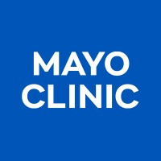
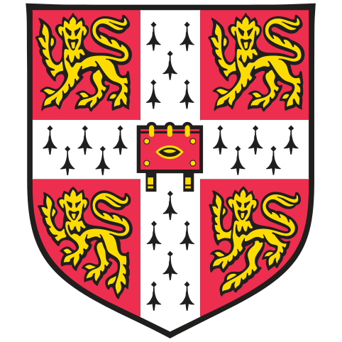

<h2 style = "margin-top: 0em;">About Me</h2>

I am an AI scientist at the 
Mayo Clinic,
<!-- <a href="https://www.mayoclinic.org">Mayo Clinic</a>,  -->
where I lead the AI and Data Analytics 
(aida)
team in the 
Department of Radiation Oncology.
<!-- [Department of Radiation Oncology](https://www.mayoclinic.org/departments-centers/radiation-oncology/home/orc-20188588). -->
We develop next-generation 
AI
systems to advance cancer treatment.
See my [faculty page](https://www.mayo.edu/research/faculty/foong-andrew-ph-d/bio-20583559) for research areas.

Before joining Mayo, I was a senior researcher
at
Microsoft Research in Cambridge,
<!-- <a href= "https://www.microsoft.com/en-us/research/lab/microsoft-research-cambridge/">Microsoft Research</a> in Cambridge, -->
UK,
where I developed generative deep learning models for proteins in the 
AI for Science team.
<!-- [AI for Science team](https://www.microsoft.com/en-us/research/lab/microsoft-research-ai4science/). -->
Our research on
<a href="https://www.microsoft.com/en-us/research/video/scalable-emulation-of-protein-equilibrium-ensembles-with-bioemu/" >BioEmu</a>
was published in the journal [*Science*](https://www.science.org/doi/10.1126/science.adv9817).

I earned my 
Ph.D.
in machine learning
at the
University of Cambridge, advised by 
Professort Richard E. Turner.
<!-- [Professor Richard E. Turner](https://rich-turner-group.github.io). -->
My research, combining probabilistic modeling and deep learning, was published at leading machine learning conferences including
neurips, iclr
and
icml.

See my selected [papers](./publications.md), or visit my Google Scholar [profile](https://scholar.google.com/citations?user=2UOjgIUAAAAJ&hl=en) for a full list.

 contact: foong [dot] andrew [at] mayo [dot] edu

<h2>Hiring News</h2>
I am hiring for research fellow positions in AI for cancer treatment in the Mayo Clinic
aida
team. Apply [here](https://jobs.mayoclinic.org/job/rochester/research-fellow-ai-and-data-analytics-aida-radiation-oncology/33647/80077797392) or reach out via [email](mailto:foong.andrew@mayo.edu).

<h2>Experience</h2>

  
  

    

      ai scientist, senior associate consultant, mayo clinic 
      <em>January 2025–present, Rochester, Minnesota, USA</em> 
      Department of Radiation Oncology 
      <em>Topics</em>: Deep learning for cancer treatment
    

  

  
  

    

      senior researcher, microsoft research 
      <em>November 2022–November 2024, Cambridge, UK</em> 
      AI for Science 
      <em>Topics</em>: Deep learning for protein generative modelling
    

  

  
  

    

      ph.d. in machine learning, university of cambridge 
      <em>October 2018–November 2022, Cambridge, UK</em> 
      Computational and Biological Learning Lab (CBL) 
      <em>Supervisor</em>: Professor Richard E. Turner 
     <em>Thesis</em>: <a href="https://www.repository.cam.ac.uk/items/bb696578-0b93-44da-82e9-4896a1ab9266">Approximate inference in Bayesian neural networks and translation equivariant neural processes</a>
    

  

  
  

    

      research scientist intern, google deepmind 
      <em>February 2022–May 2022, London, UK</em> 
      <em>Supervisor</em>: Dr. Michalis Titsias 
      <em>Topics</em>: Deep generative modelling, Gaussian processes
    

  

  
  

    

      research intern, microsoft research cambridge 
      <em>July 2021–October 2021, Cambridge, UK</em> 
      <em>Supervisor</em>: Dr. Sebastian Nowozin 
      <em>Topics</em>: Deep learning for simulating protein dynamics
    

  

  
  

    

      b.a. & m.eng. in information and computer engineering, university of cambridge 
      <em>October 2014–July 2018, Cambridge, UK</em> 
      Department of Engineering 
      First class honours with distinction, scored top 1–2% in year group
    

  

